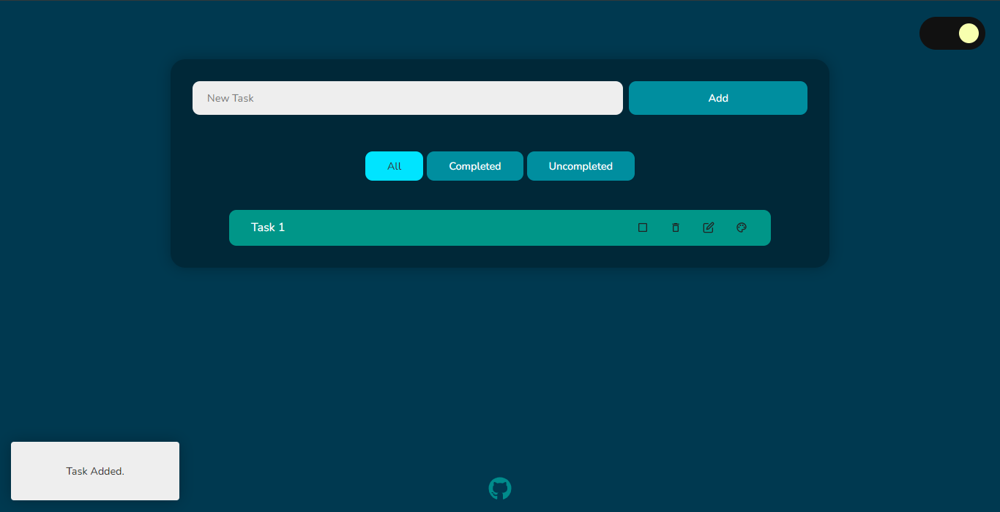
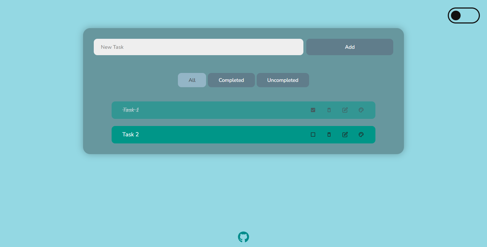
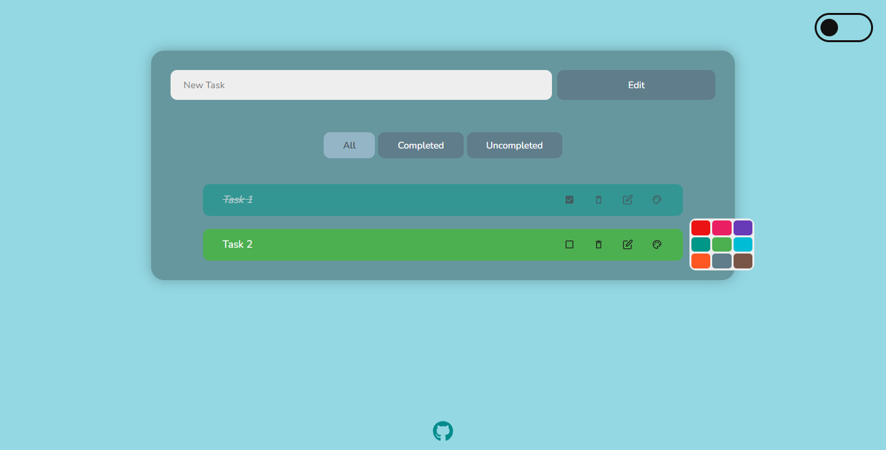

# React Todo App

A minimalistic, customisable todo app.

## Screenshots






## Features

- Dark mode
- Drag n drop tasks to reorder them
- Tasks saved locally
- Customisable task color
- Edit task
- Notification Box
- Tablet & mobile friendly

## Built with

- React Js, Css, Sass
- React Hooks : useState, useEffect, useRef, useContext
- react-beautiful-dnd, react-icons, uuidv4...


## Instructions

Install npm
```
$ npm install # or yarn
```

Run it
```bash
$ npm start # or yarn start
```